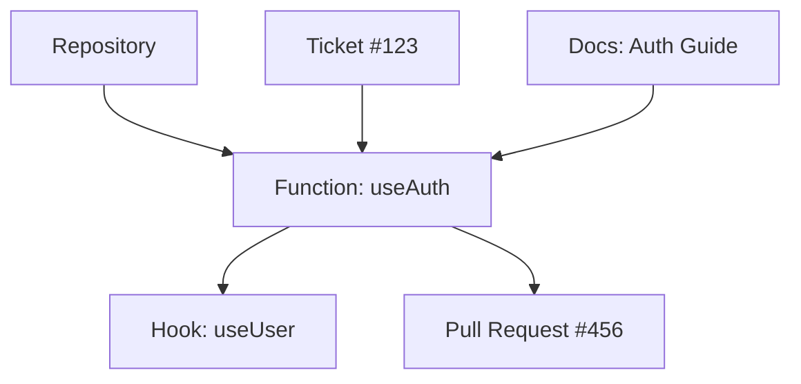

## Overview

Sequa builds a dynamic knowledge graph from your code repositories, tickets, and documentation. You gain instant insights through AI-powered queries that deliver precise answers to your team. This enables faster shipping with reduced context-switching.

<Columns cols={2}>
  <Card title="Knowledge Graph" icon="network" href="#knowledge-graph">
    Automatically maps relationships across your codebase and issues.
  </Card>
  <Card title="AI Search" icon="search" href="#ai-search">
    Natural language queries return code snippets, docs, and explanations.
  </Card>
  <Card title="Real-time Sync" icon="refresh-cw" href="#real-time">
    Updates propagate instantly as you commit code or close tickets.
  </Card>
  <Card title="Team Permissions" icon="users" href="#permissions">
    Granular controls ensure secure collaboration.
  </Card>
</Columns>

## Knowledge Graph Fundamentals

Sequa creates a real-time knowledge graph that connects your repositories, issues, and pull requests. Nodes represent functions, classes, tickets, and docs. Edges show dependencies, references, and authorship.

This graph powers contextual answers. For example, querying `{`useAuth`}` reveals implementations, callers, and related tickets.



<Callout kind="info">
  The graph updates within seconds of git pushes or ticket changes.
</Callout>

## AI-Powered Search and Answers

Ask natural questions like "How do I implement OAuth in our auth module?" Sequa scans the graph and returns synthesized answers with code, links, and explanations.

<CodeGroup tabs="JavaScript,Python">
```javascript
// Query the Sequa API for insights
const response = await fetch('https://api.sequa.dev/query', {
  method: 'POST',
  headers: { 'Authorization': 'Bearer YOUR_API_KEY' },
  body: JSON.stringify({
    query: 'Explain the payment flow in checkout module',
    context: 'repo:mycompany/shopping-cart'
  })
});

const { answer, sources } = await response.json();
console.log(answer);
```

```python
import requests

response = requests.post('https://api.sequa.dev/query', 
  headers={'Authorization': 'Bearer YOUR_API_KEY'},
  json={
    'query': 'Fix the login timeout issue',
    'context': 'repo:mycompany/webapp'
  }
)

result = response.json()
print(result['answer'])
```
</CodeGroup>

## Real-time Updates from Sources

Connect GitHub, GitLab, Jira, or Linear. Sequa ingests changes automatically.

<Steps>
  <Step title="Connect Repository" icon="git-branch">
    Authorize your GitHub account in Sequa settings.
  </Step>
  <Step title="Select Projects" icon="package">
    Choose repos and issue trackers to index.
  </Step>
  <Step title="Enable Sync" icon="refresh-cw">
    Toggle real-time updates. New commits appear in `<30s`.
  </Step>
</Steps>

## Team Access and Permissions

Control who views and edits your knowledge graph with role-based access.

<Tabs>
  <Tab title="Admin" icon="shield">
    Full access: Manage integrations, invite members, configure queries.
  </Tab>
  <Tab title="Member" icon="user">
    Query and collaborate: Ask questions, share answers, view sources.
  </Tab>
  <Tab title="Viewer" icon="eye">
    Read-only: Search the graph without editing permissions.
  </Tab>
</Tabs>

<Expandable title="Advanced Permissions" default-open="false">
  Use workspace-level roles or fine-tune per repository.

  | Role   | Query Access | Source View | Invite Users |
  |--------|--------------|-------------|--------------|
  | Admin  | Full        | All        | Yes         |
  | Member | Full        | All        | No          |
  | Viewer | Limited     | Public     | No          |
</Expandable>

<Callout kind="tip">
  Start with Viewer roles for external contributors to maintain security.
</Callout>