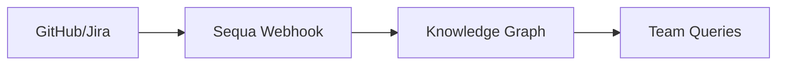

## Overview

Connect Sequa to your development tools to automatically build a real-time knowledge graph from code repositories, tickets, and notifications. These integrations pull in context from GitHub repositories, Jira tickets, Slack channels, and more, enabling instant answers for your team.

<Columns cols={3}>
  <Card title="GitHub" icon="github" href="#github-integration">
    Sync repositories and pull requests for code context.
  </Card>
  <Card title="Jira" icon="package" href="#ticket-systems">
    Import tickets and issues to track project status.
  </Card>
  <Card title="Slack" icon="message-circle" href="#notifications">
    Receive real-time updates and notifications.
  </Card>
</Columns>

<Callout kind="tip">
  Start with GitHub for the quickest setup. All integrations use secure OAuth or webhooks.
</Callout>

## GitHub Integration

Add your GitHub repositories to Sequa to index code, commits, and pull requests.

<Steps>
  <Step title="Authorize Sequa" icon="key">
    In the Sequa dashboard, navigate to Integrations > GitHub. Click "Connect with GitHub" and authorize the app.
  </Step>
  <Step title="Select Repositories" icon="git-branch">
    Choose public or private repositories. Sequa supports organization-wide access.
  </Step>
  <Step title="Verify Sync" icon="check-circle">
    Monitor the sync status. Initial indexing takes `<5` minutes per repository.
  </Step>
</Steps>

<CodeGroup tabs="CLI,Dashboard">
  ```bash
  sequa integrations add github --org my-org --repos repo1,repo2
  ```
  ```javascript
  // Dashboard API equivalent
  await sequa.integrations.connect('github', {
    org: 'my-org',
    repos: ['repo1', 'repo2']
  });
  ```
</CodeGroup>

## Ticket Systems

Integrate issue trackers to link tickets with code changes and discussions.

<Tabs>
  <Tab title="Jira" icon="package">
    <Steps>
      <Step title="Get API Token" icon="key">
        Generate a Jira API token from your Atlassian account settings.
      </Step>
      <Step title="Configure in Sequa" icon="settings">
        Enter your Jira site URL, email, and API token.
      </Step>
    </Steps>

    <ParamField header="Authorization" param-type="string" required="true">
      Basic Auth with email:token.
    </ParamField>
  </Tab>
  <Tab title="Linear" icon="trending-up">
    Use OAuth for seamless setup. Select projects to sync issues and cycles.
  </Tab>
</Tabs>

## Notifications

Set up webhooks for real-time alerts in Slack or Discord.

<Request tabs="Slack,Discord" show-lines="true">
  ```javascript
  // Slack webhook payload
  fetch('https://hooks.slack.com/services/YOUR/SLACK/WEBHOOK', {
    method: 'POST',
    headers: { 'Content-Type': 'application/json' },
    body: JSON.stringify({
      text: 'New insight from Sequa: {query}',
      attachments: [{ pretext: 'Query: user question' }]
    })
  });
  ```
  ```javascript
  // Discord webhook
  fetch('https://discord.com/api/webhooks/YOUR/WEBHOOK/URL', {
    method: 'POST',
    headers: { 'Content-Type': 'application/json' },
    body: JSON.stringify({
      content: 'Sequa update: {answer}'
    })
  });
  ```
</Request>

<Response tabs="200">
  ```json
  {
    "status": "success",
    "message": "Notification sent"
  }
  ```
</Response>

## Advanced Custom Integrations

<Expandable title="Custom Webhook Setup" default-open="false">

Build custom integrations using Sequa's webhook endpoints.

```javascript
// Example: POST to Sequa webhook
const webhookUrl = 'https://api.sequa.dev/webhooks/YOUR_WEBHOOK_ID';
await fetch(webhookUrl, {
  method: 'POST',
  headers: { 'Authorization': 'Bearer YOUR_API_KEY' },
  body: JSON.stringify({
    event: 'custom.ticket.updated',
    data: { id: 123, status: 'resolved' }
  })
});
```

Use this for tools without native support, like internal ticketing systems.

</Expandable>



These integrations ensure your knowledge graph stays current, helping your team ship faster.