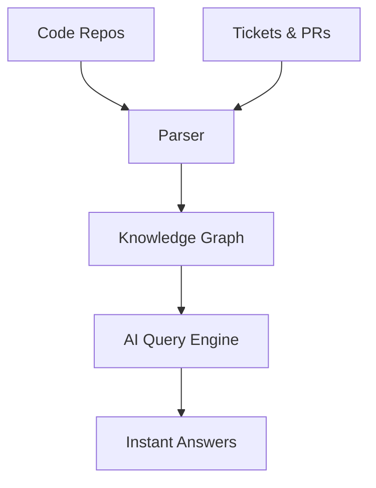

## Overview

Sequa transforms your documentation experience by creating a real-time knowledge graph from your codebases, repositories, and tickets. You get instant, accurate answers to complex questions, helping your development team ship features faster without digging through outdated docs or scattered sources.

<Columns cols={3}>
  <Card title="AI-Powered Insights" icon="zap" href="/docs/features/ai">
    Sequa analyzes your repositories in real time to surface relevant code snippets and explanations.
  </Card>
  <Card title="Knowledge Graph" icon="network" href="/docs/features/graph">
    Connects code, issues, and PRs into a searchable graph for contextual answers.
  </Card>
  <Card title="Team Efficiency" icon="users" href="/docs/features/team">
    Reduces onboarding time and speeds up debugging with precise, up-to-date information.
  </Card>
</Columns>

## Key Benefits for Teams

You benefit from Sequa in multiple ways. First, it eliminates context-switching by answering queries directly from your knowledge graph. Second, it keeps documentation always current as your code evolves. Third, it scales with your team, handling thousands of repositories without performance loss.

<Callout kind="tip">
  Start with your main repository to see immediate value—Sequa indexes it in under `{<5}` minutes.
</Callout>

## How the Knowledge Graph Works

Sequa builds a dynamic graph by parsing your Git repositories, extracting functions, classes, and dependencies. It links these to Jira tickets, GitHub issues, and PRs, creating relationships like "this function fixes issue #123".



<Steps>
  <Step title="Connect Sources" icon="link">
    Link your GitHub, GitLab, or Bitbucket repos and ticket trackers.
  </Step>
  <Step title="Index Data" icon="database">
    Sequa automatically parses and builds the graph.
  </Step>
  <Step title="Query Naturally" icon="search">
    Ask questions like "How does user authentication work?" and get code-linked responses.
  </Step>
</Steps>

## Use Cases for Faster Shipping

<Tabs>
  <Tab title="Onboarding New Developers" icon="users">
    New team members query "Implement password reset" and get step-by-step code from your repo plus related tickets.
  </Tab>
  <Tab title="Debugging Issues" icon="bug">
    Search "Fix database connection timeout" to find recent PRs, code diffs, and resolutions.
  </Tab>
  <Tab title="Feature Planning" icon="rocket">
    Explore "Integrate Stripe payments" for existing implementations, dependencies, and best practices.
  </Tab>
</Tabs>

<CodeGroup tabs="JavaScript,Python">
```javascript
// Query the knowledge graph API
const response = await fetch('https://api.sequa.dev/query', {
  method: 'POST',
  headers: { 'Authorization': 'Bearer YOUR_API_KEY' },
  body: JSON.stringify({ question: 'How to handle user auth?' })
});
const insights = await response.json();
console.log(insights.nodes); // Linked code, tickets
```

```python
# Query via Python SDK
from sequa import Client
client = Client(api_key='YOUR_API_KEY')
insights = client.query('Explain caching layer')
print(insights.graph)  # Visualize relationships
```
</CodeGroup>

<Expandable title="Advanced Customization" default-open="false">
Customize your graph with custom entity extractors for domain-specific terms like `{PaymentGateway}` or `{UserSession}`.
</Expandable>